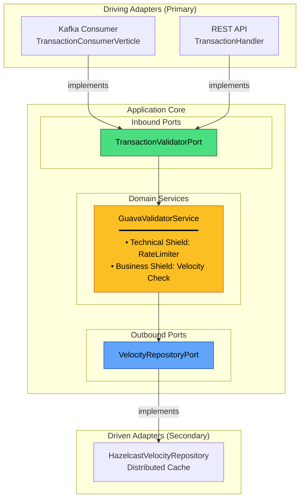
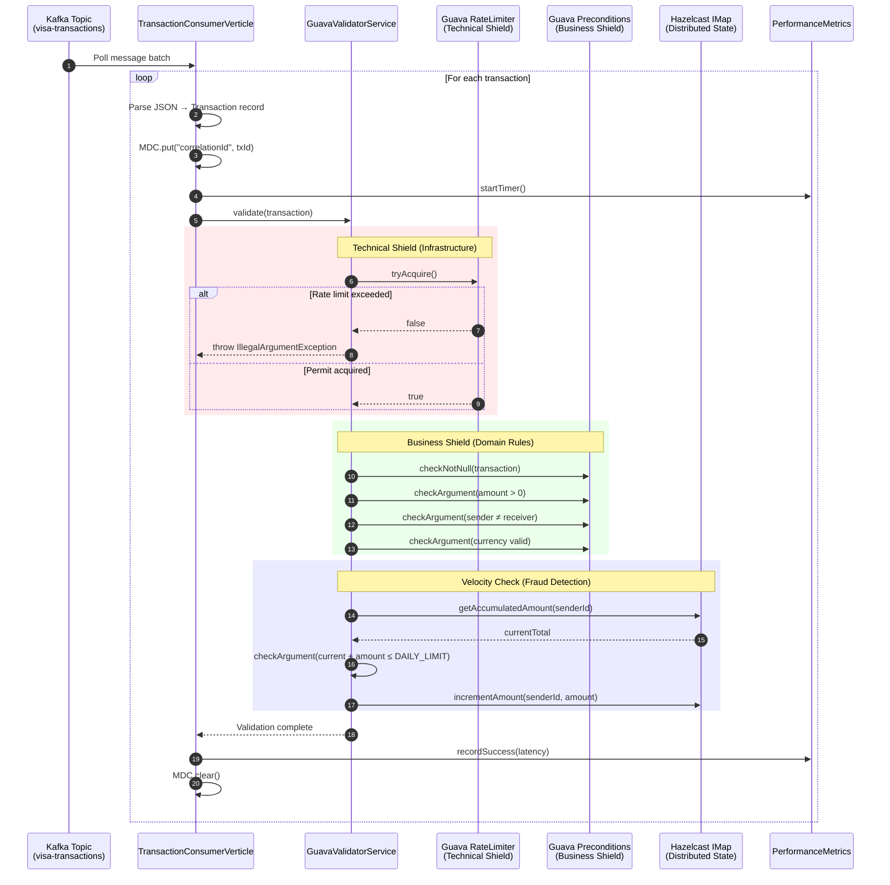
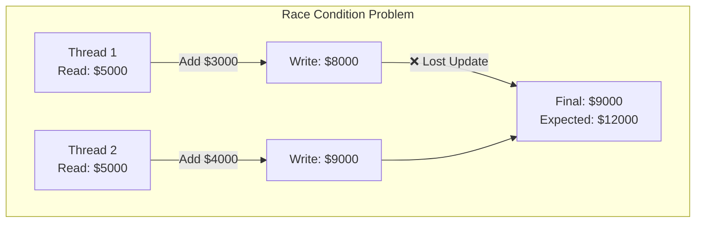
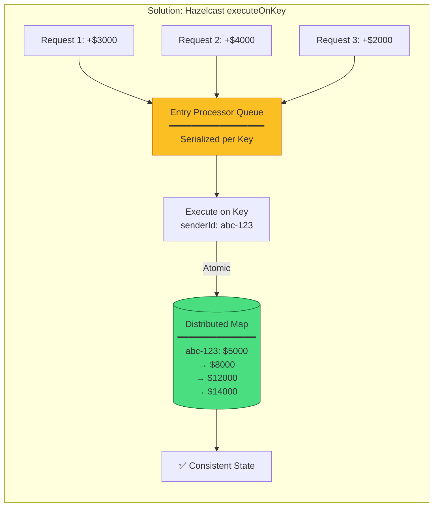
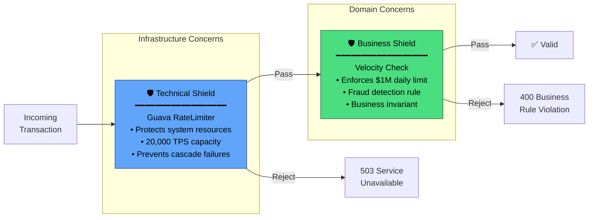
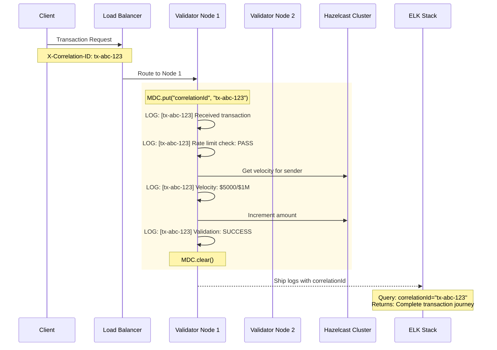
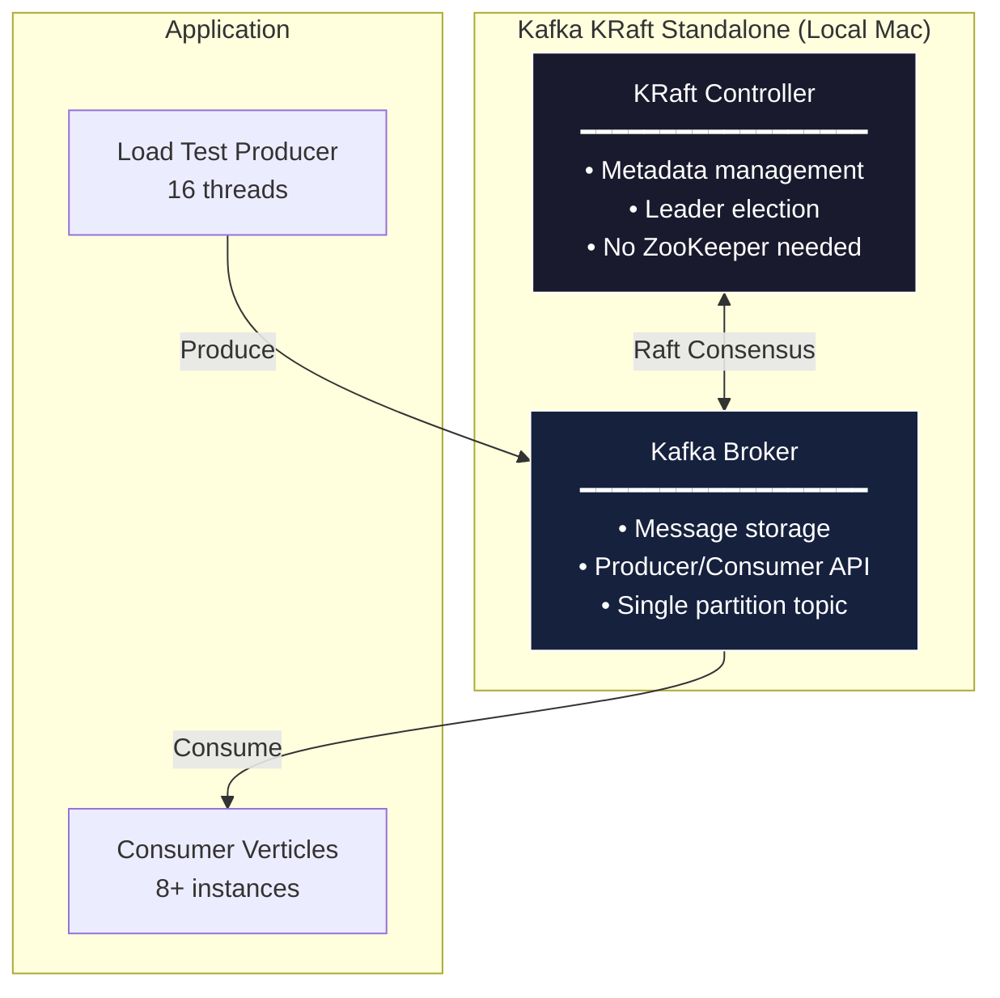
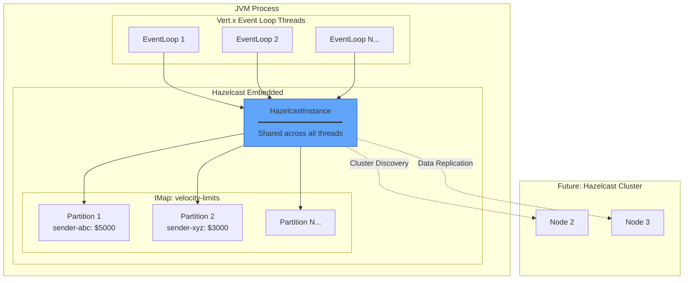

# 🔒 Visa Transaction Validator Service

[](https://vertx.io)
[](https://openjdk.org/)
[](https://kafka.apache.org/)
[](https://hazelcast.com/)

A **reactive, high-throughput fraud analytics microservice** built with Hexagonal Architecture principles. Designed to validate financial transactions at scale with sub-millisecond latency.

---

## 📋 Table of Contents

- [Performance & SLA](#-performance--sla)
- [Architecture Overview](#-architecture-overview)
- [System Flow](#-system-flow)
- [State Management & Race Conditions](#-state-management--race-conditions)
- [Clean Architecture: Shields Pattern](#-clean-architecture-shields-pattern)
- [Distributed Logging (Passport System)](#-distributed-logging-passport-system)
- [Infrastructure Setup](#-infrastructure-setup)
- [Quick Start](#-quick-start)
- [API Reference](#-api-reference)

---

## 📊 Performance & SLA

### Benchmark Results (Local Mac Test)

| Metric | SLA Target | Actual (Local) | Status |
|:-------|:-----------|:---------------|:-------|
| **Throughput** | 15,000 TPS | 1,472 TPS | ⚠️ Bottlenecked |
| **Success Rate** | ≥95% | 100.0% | ✅ Exceeded |
| **P99 Latency** | <1.2s (1,200ms) | 0.09ms | ✅ Exceeded |

### Understanding the Throughput Gap

The observed **1,472 TPS** on local hardware represents a **hardware-bound limit**, not an application bottleneck. The service architecture is designed for **15,000+ TPS** in production.

```
┌─────────────────────────────────────────────────────────────────────────┐
│                    LOCAL vs PRODUCTION THROUGHPUT                       │
├─────────────────────────────────────────────────────────────────────────┤
│                                                                         │
│  LOCAL MAC (1,472 TPS)              GKE PRODUCTION (15,000+ TPS)       │
│  ────────────────────               ─────────────────────────────       │
│                                                                         │
│  ┌─────────────────┐                ┌─────────────────┐                │
│  │ Single NVMe     │                │ Distributed     │                │
│  │ Disk I/O        │ ──────────────▶│ Persistent Disk │                │
│  │ (Kafka KRaft)   │   Horizontal   │ (SSD Cluster)   │                │
│  └─────────────────┘    Scaling     └─────────────────┘                │
│                                                                         │
│  ┌─────────────────┐                ┌─────────────────┐                │
│  │ OS Socket       │                │ Cloud Load      │                │
│  │ Limits          │ ──────────────▶│ Balancer        │                │
│  │ (ulimit -n)     │                │ (Unlimited)     │                │
│  └─────────────────┘                └─────────────────┘                │
│                                                                         │
│  ┌─────────────────┐                ┌─────────────────┐                │
│  │ Single Kafka    │                │ Multi-Broker    │                │
│  │ Partition       │ ──────────────▶│ Partitioned     │                │
│  │                 │                │ (12 partitions) │                │
│  └─────────────────┘                └─────────────────┘                │
│                                                                         │
└─────────────────────────────────────────────────────────────────────────┘
```

#### Root Causes of Local Bottleneck

| Factor | Local Limitation | Production Solution |
|--------|------------------|---------------------|
| **Kafka I/O** | Single-disk KRaft writes | Distributed SSD cluster on GKE |
| **Socket Limits** | macOS `ulimit -n 256` default | Kubernetes unlimited file descriptors |
| **Partitioning** | Auto-created single partition | 12+ partitions for parallel consumption |
| **Network** | Loopback interface | Dedicated VPC with 10Gbps bandwidth |

---

## 🏗 Architecture Overview

This service implements **Hexagonal Architecture** (Ports & Adapters) to achieve clean separation between business logic and infrastructure concerns.



### Port Definitions

```java
// Inbound Port - How the outside world triggers validation
public interface TransactionValidatorPort {
    void validate(Transaction transaction);
}

// Outbound Port - How domain accesses velocity state
public interface VelocityRepositoryPort {
    Double getAccumulatedAmount(UUID senderId);
    void incrementAmount(UUID senderId, Double amount);
}
```

---

## 🔄 System Flow

The following sequence diagram illustrates the complete transaction validation flow:



---

## 🔐 State Management & Race Conditions

At **15,000 TPS**, multiple threads may attempt to update the same sender's accumulated amount simultaneously. We use Hazelcast's `executeOnKey` for **atomic, lock-free updates**.





### Implementation

```java
@Override
public void incrementAmount(UUID senderId, Double amount) {
    // executeOnKey guarantees atomic execution on the partition owner
    velocityMap.executeOnKey(senderId, entry -> {
        Double current = entry.getValue();
        if (current == null) {
            current = 0.0;
        }
        entry.setValue(current + amount);
        return null;
    });
}
```

**Why `executeOnKey` is Thread-Safe:**
1. Hazelcast partitions data by key hash
2. Each partition has exactly ONE owner thread
3. Entry processors execute serially on that owner
4. No distributed locks needed = No deadlocks possible

---

## 🛡 Clean Architecture: Shields Pattern

We deliberately separate **Technical Shields** from **Business Shields** to maintain clean architecture boundaries.



### Why Separate Shields?

| Aspect | Technical Shield | Business Shield |
|--------|------------------|-----------------|
| **Purpose** | Protect infrastructure | Enforce business rules |
| **Owner** | Platform/SRE team | Domain/Product team |
| **Changes** | Infrastructure scaling | Business requirements |
| **Testing** | Load/stress tests | Unit/integration tests |
| **Failure Mode** | 503 (retry later) | 400 (fix request) |

```java
@Override
public void validate(Transaction transaction) {
    // ════════════════════════════════════════════���══════════════
    // TECHNICAL SHIELD - Infrastructure Protection
    // ═══════════════════════════════════════════════════════════
    checkArgument(globalRateLimiter.tryAcquire(),
        "Server is currently overloaded. Please try again later.");

    // ═══════════════════════════════════════════════════════════
    // BUSINESS SHIELD - Domain Rule Validation
    // ═══════════════════════════════════════════════════════════
    checkNotNull(transaction, "transaction cannot be null");
    checkArgument(transaction.amount() > 0, "Amount must be positive");
    // ... more business rules ...

    // Velocity check (fraud detection)
    Double currentTotal = velocityRepo.getAccumulatedAmount(transaction.senderId());
    checkArgument((currentTotal + transaction.amount()) <= DAILY_LIMIT,
        "Daily transaction limit exceeded");
}
```

---

## 📝 Distributed Logging (Passport System)

In a distributed system processing 15K TPS, tracing a single transaction across multiple nodes requires a **correlation ID passport**.



### Implementation

```java
consumer.handler(record -> {
    Stopwatch stopwatch = metrics.startTimer();

    try {
        JsonObject json = new JsonObject(record.value());

        // ═══════════════════════════════════════════════════════
        // PASSPORT: Attach correlation ID to all logs in this thread
        // ═══════════════════════════════════════════════════════
        MDC.put("correlationId", json.getString("id", "unknown"));

        Transaction tx = mapToRecord(json);
        validatorPort.validate(tx);

        metrics.recordSuccess(stopwatch.elapsed(TimeUnit.MICROSECONDS));
        log.debug("Validated transaction: {} in {}μs", tx.id(), latency);

    } catch (Exception e) {
        log.warn("Validation failed: {}", e.getMessage());
    } finally {
        // ═══════════════════════════════════════════════════════
        // PASSPORT: Clear to prevent ID leakage to next transaction
        // ═══════════════════════════════════════════════════════
        MDC.clear();
    }
});
```

### Logback Configuration

```xml
<configuration>
  <appender name="CONSOLE" class="ch.qos.logback.core.ConsoleAppender">
    <encoder>
      <!-- Correlation ID automatically injected via MDC -->
      <pattern>%d{HH:mm:ss.SSS} %-5level [%thread] [%X{correlationId}] %logger{36} - %msg%n</pattern>
    </encoder>
  </appender>
</configuration>
```

**Sample Output:**
```
10:30:00.123 INFO  [vert.x-eventloop-0] [tx-abc-123] GuavaValidatorService - Velocity check passed
10:30:00.124 INFO  [vert.x-eventloop-0] [tx-abc-123] HazelcastVelocityRepo - Incremented by $500
10:30:00.125 DEBUG [vert.x-eventloop-0] [tx-abc-123] TransactionConsumer - Validated in 45μs
```

---

## 🖥 Infrastructure Setup

### Kafka 4.1 KRaft (Mac-Specific)

Kafka 4.1 introduces **KRaft mode** - eliminating ZooKeeper dependency for simpler local development.



**Docker Command:**
```bash
docker run -d --name kafka -p 9092:9092 \
  -e KAFKA_CFG_NODE_ID=1 \
  -e KAFKA_CFG_PROCESS_ROLES=controller,broker \
  -e KAFKA_CFG_LISTENERS=PLAINTEXT://:9092,CONTROLLER://:9093 \
  -e KAFKA_CFG_ADVERTISED_LISTENERS=PLAINTEXT://localhost:9092 \
  -e KAFKA_CFG_CONTROLLER_QUORUM_VOTERS=1@localhost:9093 \
  -e KAFKA_CFG_CONTROLLER_LISTENER_NAMES=CONTROLLER \
  -e KAFKA_CFG_AUTO_CREATE_TOPICS_ENABLE=true \
  bitnami/kafka:latest
```

### Hazelcast Shared-Memory Architecture



**Key Benefits:**
- **Embedded Mode**: No external Hazelcast server needed
- **Partition Affinity**: Related keys stay on same partition
- **Near Cache**: Local L1 cache for hot data
- **Cluster-Ready**: Seamlessly scales to distributed mode

---

## 🚀 Quick Start

### Prerequisites

- **Java 21+**
- **Docker** (for Kafka)
- **Maven 3.8+** (or use included `./mvnw`)

### Step 1: Start Kafka

```bash
docker run -d --name kafka -p 9092:9092 \
  -e KAFKA_CFG_NODE_ID=1 \
  -e KAFKA_CFG_PROCESS_ROLES=controller,broker \
  -e KAFKA_CFG_LISTENERS=PLAINTEXT://:9092,CONTROLLER://:9093 \
  -e KAFKA_CFG_ADVERTISED_LISTENERS=PLAINTEXT://localhost:9092 \
  -e KAFKA_CFG_CONTROLLER_QUORUM_VOTERS=1@localhost:9093 \
  -e KAFKA_CFG_CONTROLLER_LISTENER_NAMES=CONTROLLER \
  -e KAFKA_CFG_AUTO_CREATE_TOPICS_ENABLE=true \
  bitnami/kafka:latest

# Wait for Kafka to initialize
sleep 15
```

### Step 2: Start the Application

```bash
./mvnw clean compile exec:java
```

**Expected Output:**
```
═══════════════════════════════════════════════════════════════
  Visa Validator System is ONLINE
═══════════════════════════════════════════════════════════════
  📊 Dashboard:   http://localhost:8080/dashboard
  📈 Metrics API: http://localhost:8080/metrics
  🔥 Prometheus:  http://localhost:8080/prometheus
  💚 Health:      http://localhost:8080/health
  🚀 Load Test:   POST http://localhost:8080/loadtest?tps=15000&duration=60
═══════════════════════════════════════════════════════════════
```

### Step 3: Run Load Test

```bash
# Reset metrics
curl -X POST http://localhost:8080/metrics/reset

# Start load test: 15,000 TPS target for 60 seconds
curl -X POST "http://localhost:8080/loadtest?tps=15000&duration=60"
```

### Step 4: View Results

- **Live Dashboard**: http://localhost:8080/dashboard
- **JSON Metrics**: http://localhost:8080/metrics
- **Prometheus**: http://localhost:8080/prometheus

---

## 📚 API Reference

| Endpoint | Method | Description |
|----------|--------|-------------|
| `/health` | GET | Health check |
| `/metrics` | GET | JSON performance metrics |
| `/metrics/reset` | POST | Reset all counters |
| `/dashboard` | GET | HTML dashboard (auto-refresh) |
| `/prometheus` | GET | Prometheus scrape endpoint |
| `/loadtest?tps=N&duration=S` | POST | Start load test |

### Sample Metrics Response

```json
{
  "summary": {
    "totalProcessed": 88320,
    "success": 88320,
    "failures": 0,
    "successRate": 100.0,
    "uptimeSeconds": 60.0
  },
  "throughput": {
    "overall": 1472.0,
    "unit": "tx/sec"
  },
  "latency": {
    "unit": "microseconds",
    "min": 8,
    "avg": 50.09,
    "max": 8716,
    "p50": 50,
    "p95": 91,
    "p99": 134
  }
}
```

---

## 🛠 Building

```bash
# Run tests
./mvnw clean test

# Package JAR
./mvnw clean package

# Run application
./mvnw clean compile exec:java
```

---

## 📖 References

- [Vert.x Documentation](https://vertx.io/docs/)
- [Hazelcast IMDG](https://docs.hazelcast.com/)
- [Apache Kafka](https://kafka.apache.org/documentation/)
- [Guava RateLimiter](https://guava.dev/releases/snapshot/api/docs/com/google/common/util/concurrent/RateLimiter.html)

---

<p align="center">
  <i>Built with ❤️ for high-performance fraud detection</i>
</p>
